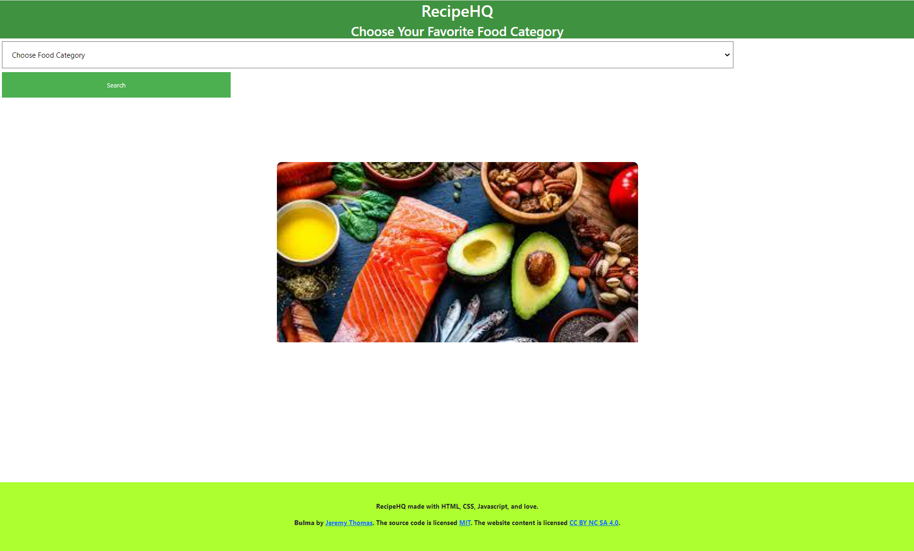

# RecipeHQ

## Description
RecipeHQ was created for all new and experienced cooks wanting to try various types of food. They will have options such as Vegan, Gluten-Free, and of course, meat-based. The user will be presented with the recipe for each dish as well as a YouTube link that will allow them to search for a video on how to prepare the dish. 

## User Story
```
- AS a cook wanting to try new types of food
- I WANT to seek new recipes
- SO THAT I can make various new dishes
```
## Acceptance Criteria
```
- GIVEN I am searching for a recipe
- WHEN I click on a food category
- THEN I am presented with recipes based on the category selected
- WHEN I click on my preferred recipe
- THEN I am presented with the recipe AND the food image
- THEN I will see a YouTube video on how to prepare the dish
```
## Usage

## Mockup


## GitHub
https://github.com/Sadat6/RecipeHQ

## Deployment